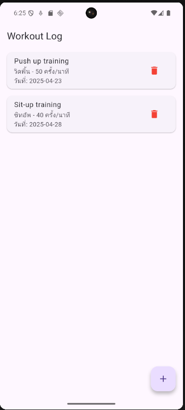
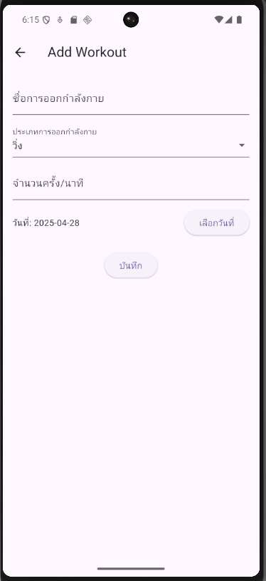
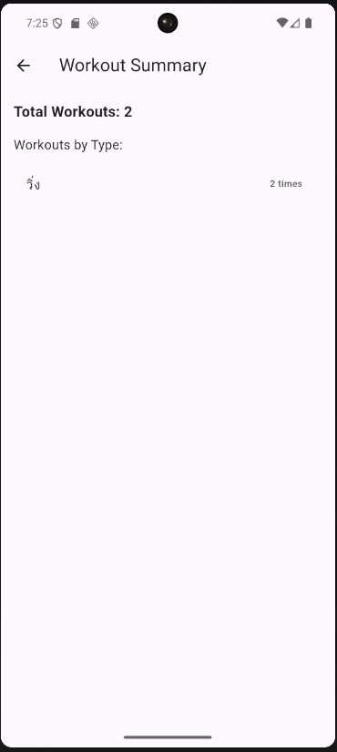
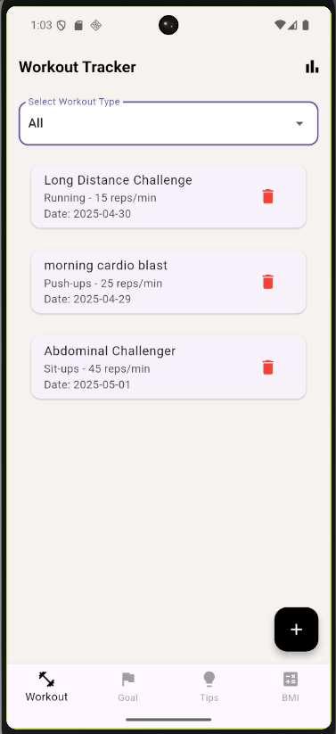
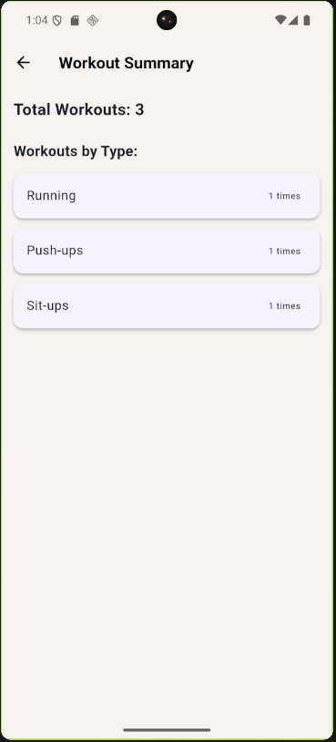
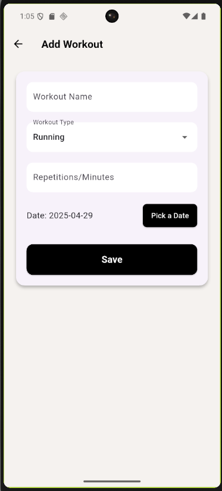
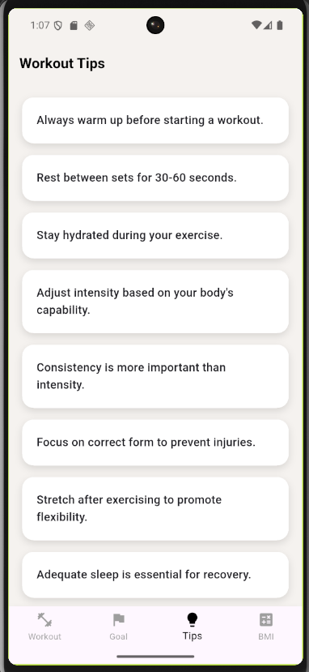
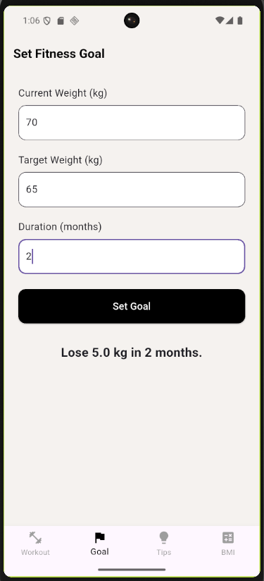
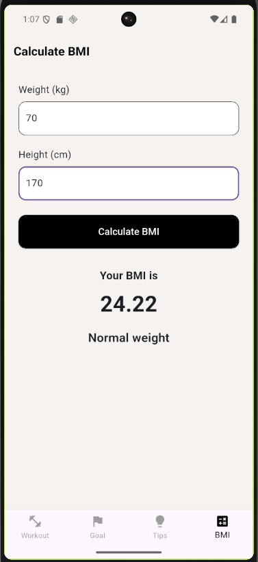

# งานสอบ Take-home | Take-home Assignment Template

ชื่อ - นามสกุล (Full Name):  
Parinya Chotchungtakul

รหัสนักศึกษา (Student ID):  
6631503112

ชื่อแอป (App Name):  
Workout Tracker

Framework ที่ใช้ (Framework Used):  
Flutter

ลิงก์ GitHub Repository:  
https://github.com/ParinyaLeo/workout_tracker

ลิงก์ไฟล์ติดตั้ง (APK/IPA):  
[app-release.apk](https://drive.google.com/file/d/your-apk-link-here/view?usp=sharing)

ลิงก์ซิป (ZIP):  
workout_tracker_project.zip

---

# 1. การออกแบบแอป | App Concept and Design (2 คะแนน / 2 pts)

## 1.1 ผู้ใช้งานเป้าหมาย | User Personas
- Persona 1:  
  ชื่อ: Leo, อายุ: 20 ปี, นักศึกษาปี 2  
  ความต้องการ: ต้องการบันทึกและติดตามกิจกรรมการออกกำลังกายประจำวัน

- Persona 2:  
  ชื่อ: Mint, อายุ: 20 ปี, นักศึกษาปี 2  
  ความต้องการ: อยากได้แอปที่ช่วยวางแผนเป้าหมายการลดน้ำหนักและฟิตหุ่น

## 1.2 เป้าหมายของแอป | App Goals
- บันทึกการออกกำลังกายรายวัน เช่น วิ่ง, ปั่นจักรยาน, วิดพื้น
- ตั้งเป้าหมายน้ำหนัก และระยะเวลาในการบรรลุเป้าหมาย
- คำนวณ BMI และแนะนำทิปส์การออกกำลังกาย
- ใช้งานง่าย เหมาะสำหรับผู้เริ่มต้นออกกำลังกาย

## 1.3 โครงร่างหน้าจอ / Mockup

  
*Home page displaying workout list with filter by workout type.*

  
*Add Workout page for adding new workout activities.*

  
*Fitness Goal page for setting weight and duration goals.*

## 1.4 การไหลของผู้ใช้งาน | User Flow
เปิดแอป ➔ ดูบันทึกการออกกำลังกาย ➔ เพิ่มข้อมูลใหม่ ➔ บันทึกเป้าหมาย ➔ ติดตามผลลัพธ์

---

# 2. การพัฒนาแอป | App Implementation (4 คะแนน / 4 pts)

## 2.1 รายละเอียดการพัฒนา | Development Details
Tools used:
- Flutter 3.19
- Dart 3.2

Packages:
- provider (สำหรับ state management)
- shared_preferences (สำหรับเก็บข้อมูล workouts และ goals)

## 2.2 ฟังก์ชันที่พัฒนา | Features Implemented
- [x] บันทึกกิจกรรมการออกกำลังกาย (Add Workout)
- [x] ลบข้อมูลการออกกำลังกาย (Delete Workout)
- [x] ฟิลเตอร์ตามประเภทการออกกำลังกาย
- [x] ตั้งเป้าหมายการออกกำลังกาย (Set Fitness Goal)
- [x] คำนวณ BMI (BMI Calculator)
- [x] แนะนำเคล็ดลับการออกกำลังกาย (Workout Tips)

## 2.3 ภาพหน้าจอแอป | App Screenshots

  
*Home page displaying workout list with type filter.*

  
*Summary page showing number of workouts by type.*

  
*Add Workout page with input fields.*

  
*Tips page providing exercise advice.*

  
*Set Goal page for weight management.*

  
*BMI page showing BMI calculation results.*

---

# 3. การ Build และติดตั้งแอป | Deployment (2 คะแนน / 2 pts)

## 3.1 ประเภท Build | Build Type
- [x] Debug

## 3.2 แพลตฟอร์มที่ทดสอบ | Platform Tested
- [x] Android

## 3.3 ไฟล์ README และวิธีติดตั้ง | README & Install Guide
1. ดาวน์โหลดไฟล์ APK
2. เปิดผ่าน File Manager
3. ติดตั้งไฟล์ .apk
4. เปิดใช้งานแอป Workout Tracker

---

# 4. การสะท้อนผลลัพธ์ | Reflection (2 คะแนน / 2 pts)

- ได้เรียนรู้การจัดการ State Management เบื้องต้น
- เข้าใจการใช้ Provider และ SharedPreferences เพื่อเก็บข้อมูลผู้ใช้
- พบปัญหาเรื่อง Navigation ตอนจัดการ Bottom Navigation Bar แต่สามารถแก้ไขได้
- ถ้ามีเวลาเพิ่มเติม อยากพัฒนาระบบ Notification แจ้งเตือนให้ออกกำลังกาย

---

# 5. การใช้ AI ช่วยพัฒนา | AI Assisted Development (Bonus / ใช้ประกอบการพิจารณา)

## 5.1 ใช้ AI ช่วยคิดไอเดีย | Idea Generation
Prompt ที่ใช้:  
"Suggest mobile app ideas for workout and fitness tracking."

ผลลัพธ์:  
ได้แนวคิดแอป Workout Tracker สำหรับการบันทึกและติดตามกิจกรรมการออกกำลังกาย

## 5.2 ใช้ AI ช่วยออกแบบ UI | UI Layout Prompt
Prompt ที่ใช้:  
"Design a clean workout tracking app layout in Flutter."

ผลลัพธ์:  
ได้แนวทางโครงสร้างแอปแบ่งเป็น Home, Add Workout, Set Goal, Tips, BMI

## 5.3 ใช้ AI ช่วยเขียนโค้ด | Code Writing Prompt
Prompt ที่ใช้:  
"Flutter code for adding a new workout with TextField inputs and saving it."

ผลลัพธ์:  
สามารถสร้างหน้าฟอร์มบันทึกข้อมูล Workout ได้อย่างรวดเร็ว

## 5.4 ใช้ AI ช่วย debug | Debug Prompt
Prompt ที่ใช้:  
"My Flutter BottomNavigationBar resets when changing tabs. How to preserve page states?"

ผลลัพธ์:  
AI แนะนำใช้ IndexedStack เพื่อรักษาหน้าเก่าไว้ ทำให้แก้ปัญหา Navigation Reset ได้

## 5.5 ใช้ AI ช่วย Deploy | Deployment Prompt
Prompt ที่ใช้:  
"How to build Flutter app APK file for Android testing?"

ผลลัพธ์:  
ได้คำสั่ง flutter build apk และสามารถติดตั้งไฟล์บนมือถือ Android ได้สำเร็จ

---
